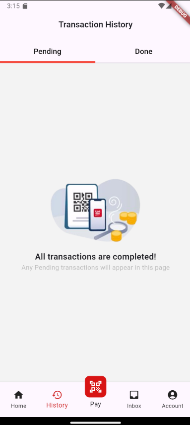
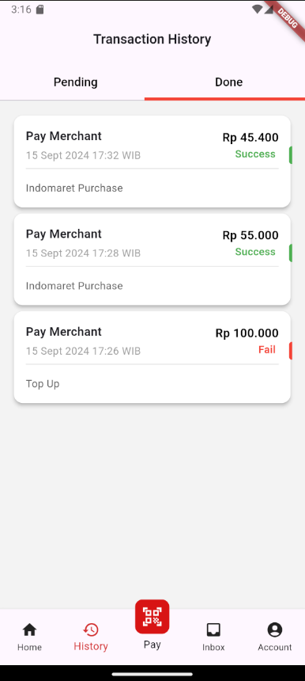
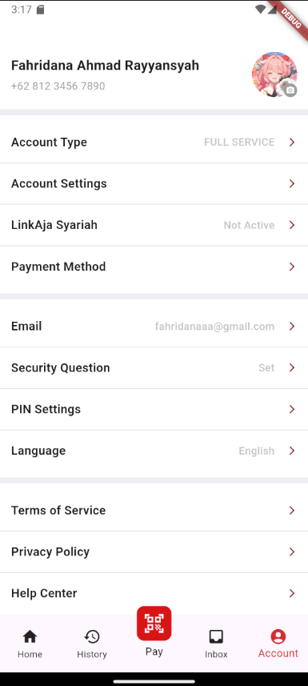

# linkajajaja

Melakukan slicing pada aplikasi LinkAja untuk uts pemrograman mobile

## Installation

1. Clone the repository

    ```bash
    git clone https://github.com/Fahridanaa/linkajajaja.git
    ```
2. Navigate into the project directory
   ```bash
   cd linkajajaja
   ```
3. Install dependencies
   ```bash
   flutter pub get
   ```
4. Run the project
   ```bash
   flutter run
   ```

## Screenshot
- 
- 
- 
- 
